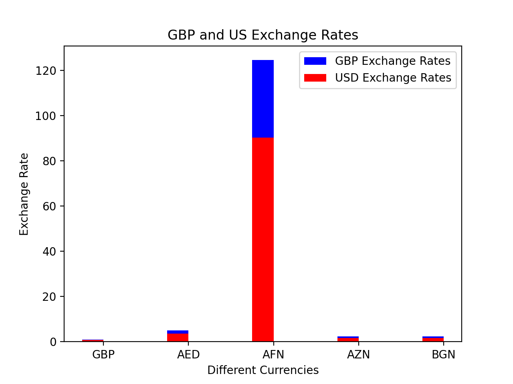
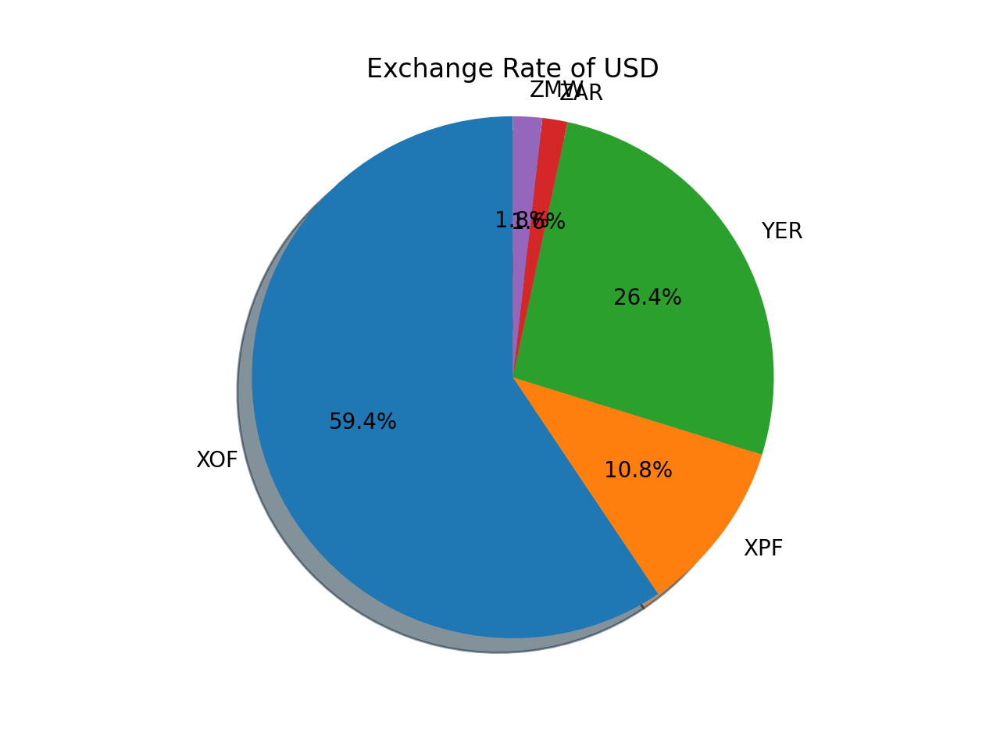

# Currency Data Visualization

## Comparing USD and GBP Exchange Rates

This is a bar graph comparing GBP and USD exchange rates. I chose blue for the UK because the UK has blue in the flag and red for the US because it has red in the flag. Both have both colors in the flag.

## GBP Exchange Rates

This is a pie chart about the UK exchange rates. I used many different colors!